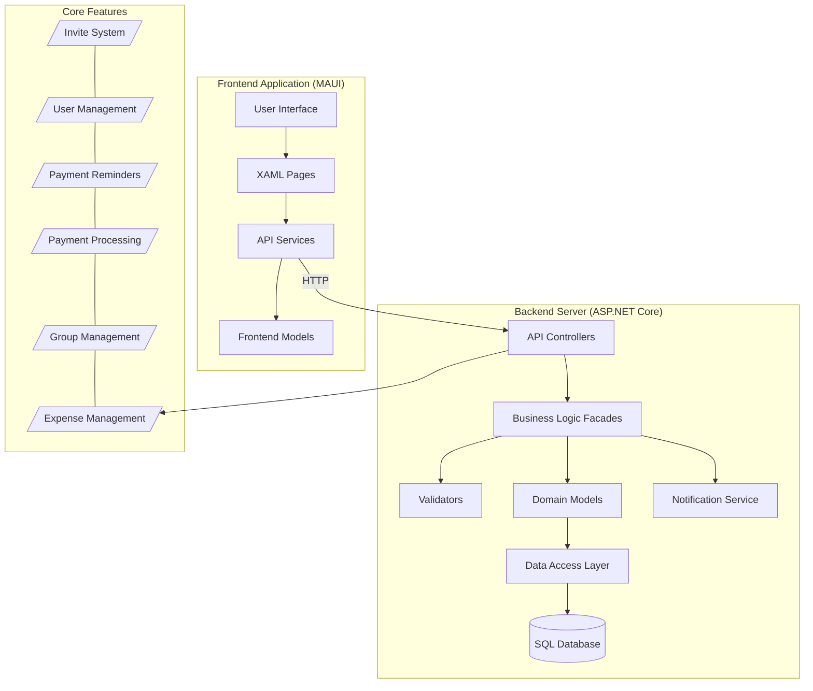
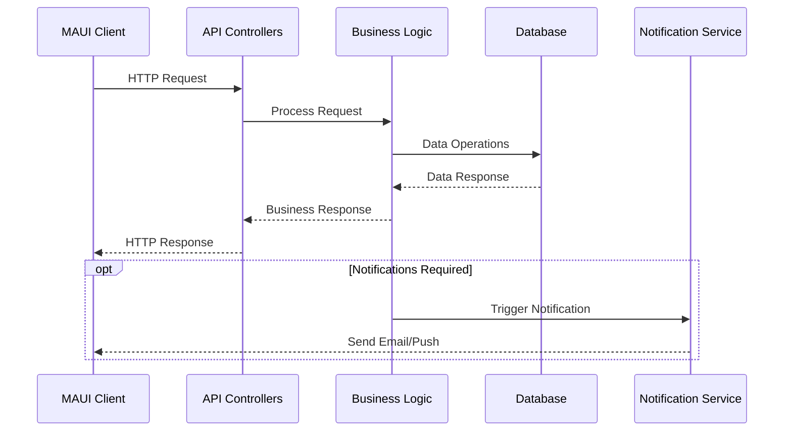
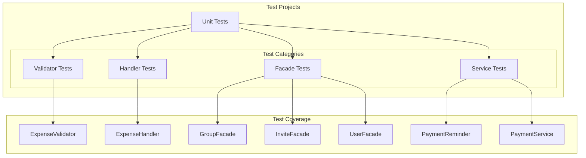
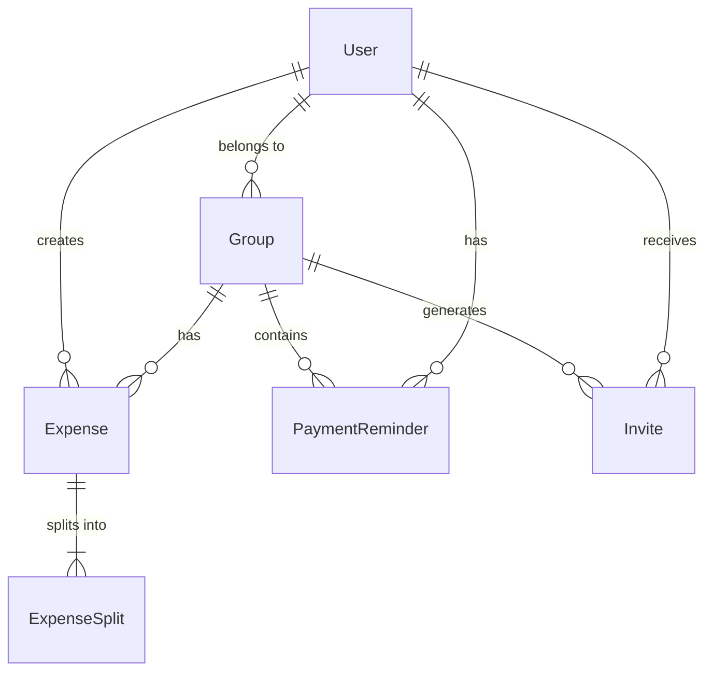
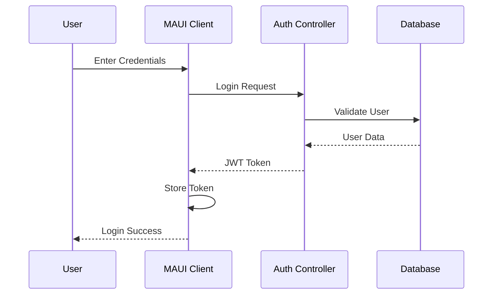
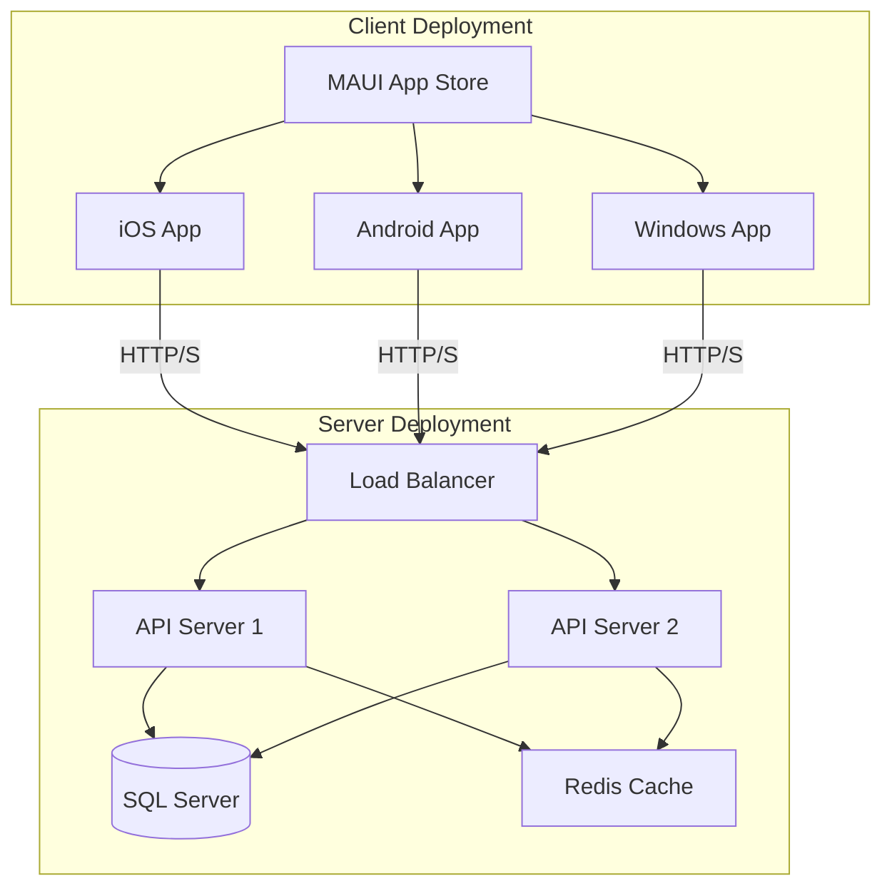
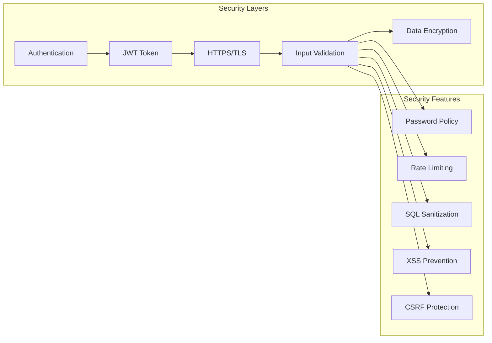
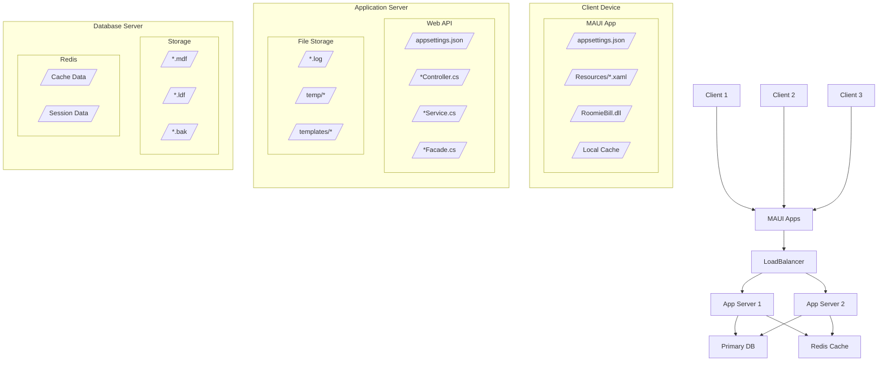
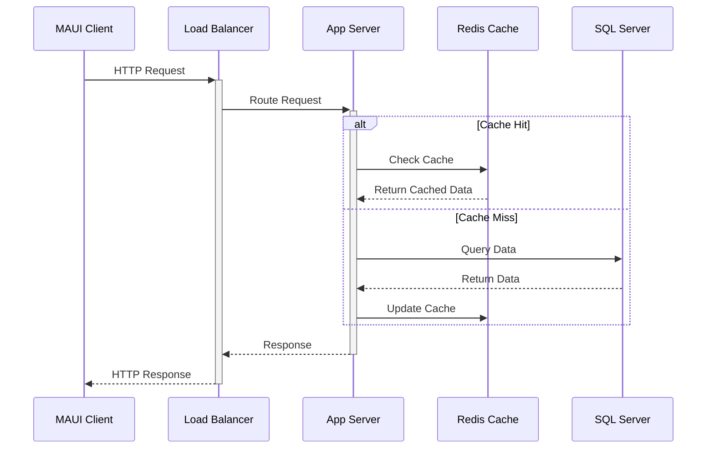
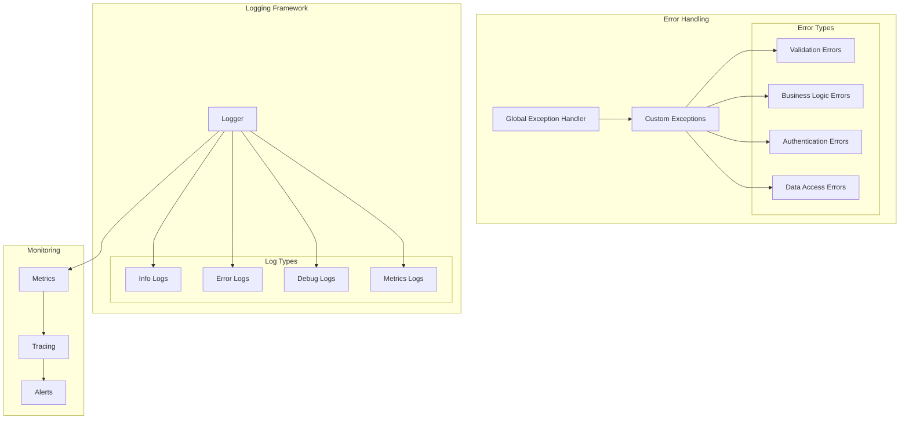

# RoomieBill System Architecture



## Component Details

### Frontend (MAUI Application)
- **User Interface**: XAML-based UI components
- **Pages**: Login, Register, Group Management, Expenses, Payments
- **Services**: API integration services for backend communication
- **Models**: Data models matching backend DTOs

### Backend (ASP.NET Core)
- **API Controllers**: RESTful endpoints for client communication
- **Facades**: Business logic implementation
- **Validators**: Input validation and business rules
- **Domain Models**: Core business entities
- **Data Access**: Entity Framework Core with SQL Server
- **Notification Service**: Email notifications for invites/reminders

### Core Features
- **Expense Management**: Track and split expenses
- **Group Management**: Create/manage roommate groups
- **Payment Processing**: Handle payments between users
- **Payment Reminders**: Automated payment notifications
- **User Management**: Authentication and profile management
- **Invite System**: Group invitation handling

## Data Flow



## Testing Architecture



## Data Relationships




## Authentication Flow



## Deployment Architecture



## Security Architecture



Key Security Features:
- **Authentication**: JWT-based authentication with refresh tokens
- **Transport Security**: HTTPS/TLS for all API communications
- **Data Protection**: Encryption at rest for sensitive data
- **Input Validation**: Client and server-side validation
- **Rate Limiting**: Prevents abuse of API endpoints
- **SQL Protection**: Parameterized queries and ORM usage
- **XSS Prevention**: Input sanitization and output encoding
- **CSRF Protection**: Anti-forgery tokens for forms

## System Components & Deployment

### Component Distribution

The RoomieBill system is distributed across three main deployment targets:

1. **Client Devices**
   - MAUI Application Files (*.dll, *.exe)
   - Local Configuration (appsettings.json)
   - Cache Directory (~/AppData/Local/RoomieBill)
   - JWT Token Storage
   - UI Resources (images, styles)

2. **Application Servers**
   - ASP.NET Core Web API
   - Business Logic Layer
   - API Controllers
   - Validation Components
   - Email Service
   - Logging Service

3. **Database Servers**
   - SQL Server Database
   - Redis Cache
   - Database Backups
   - Migration Scripts

### File Distribution



### Component Responsibilities

1. **MAUI Frontend (Client-side)**
   - User Interface Rendering
   - Local State Management
   - API Communication
   - Form Validation
   - File Location: Deployed to client devices via app stores

2. **ASP.NET Core Backend (Server-side)**
   - API Endpoints
   - Business Logic
   - Data Validation
   - Authentication/Authorization
   - File Location: Deployed to cloud servers

3. **Database Layer**
   - Data Storage
   - Transaction Management
   - Data Integrity
   - File Location: Dedicated database servers

### File Locations & Purpose

#### Client Files
- `/FrontendApplication/*.dll` - MAUI application binaries
- `/FrontendApplication/Resources/*` - UI resources and assets
- `%AppData%/RoomieBill/cache/*` - Local cache data
- `%AppData%/RoomieBill/config.json` - Client configuration

#### Server Files
- `/Roomiebill.Server/*.dll` - Server application binaries
- `/Roomiebill.Server/appsettings.json` - Server configuration
- `/Roomiebill.Server/logs/*` - Application logs
- `/Roomiebill.Server/templates/*` - Email templates

#### Database Files
- `SQLSERVER/RoomieBill.mdf` - Main database file
- `SQLSERVER/RoomieBill.ldf` - Database log file
- `REDIS/dump.rdb` - Redis persistence file

### Communication Patterns



### Network Configuration

1. **Client-Server Communication**
   - Protocol: HTTPS (443)
   - Load Balancer: Azure Load Balancer
   - SSL/TLS: Version 1.3
   - Connection Pool: Max 100 per server

2. **Inter-Server Communication**
   - Protocol: Internal TCP
   - Port Range: 8000-8010
   - Firewall Rules: Allow internal subnet only
   - Load Balancing: Round-robin

3. **Database Connections**
   - SQL Server: Port 1433
   - Redis: Port 6379
   - Connection Pooling: Enabled
   - Max Pool Size: 200

4. **Network Security**
   - VPN Access for Administration
   - Network Segmentation
   - DDoS Protection
   - Web Application Firewall (WAF)

### Data Persistence & State Management

1. **Client-Side State**
   ```mermaid
   graph LR
       subgraph "MAUI Client"
           LS[Local Storage]
           IC[In-Memory Cache]
           SS[Session Storage]
           
           LS --> IC
           SS --> IC
       end
       
       subgraph "State Types"
           UI[UI State]
           Auth[Auth Data]
           Forms[Form Data]
           
           IC --> UI
           LS --> Auth
           SS --> Forms
       end
   ```

2. **Server-Side State**
   ```mermaid
   graph LR
       subgraph "Persistence Layers"
           Redis[Redis Cache]
           SQL[SQL Server]
           Temp[Temp Storage]
           
           Redis --> SQL
           Temp --> SQL
       end
       
       subgraph "Data Categories"
           Session[Session Data]
           Trans[Transactional]
           Perm[Permanent]
           
           Redis --> Session
           SQL --> Trans
           SQL --> Perm
       end
   ```

#### State Management Strategy

1. **Transient Data**
   - UI State: Client memory
   - Session Data: Redis cache
   - Form Data: Local storage
   
2. **Persistent Data**
   - User Data: SQL Server
   - Business Data: SQL Server
   - Auth Tokens: Secure storage
   
3. **Caching Strategy**
   - L1: Client memory cache
   - L2: Redis distributed cache
   - L3: SQL Server
   
4. **Data Sync**
   - Real-time: WebSocket notifications
   - Background: Periodic sync
   - On-demand: User-triggered

## Error Handling & Logging



Key Error Handling Features:
- **Global Exception Handler**: Centralizes error handling
- **Custom Exceptions**: Domain-specific error types
- **Error Response Model**: Standardized error responses
- **Logging & Monitoring**: Tracks system health and issues
