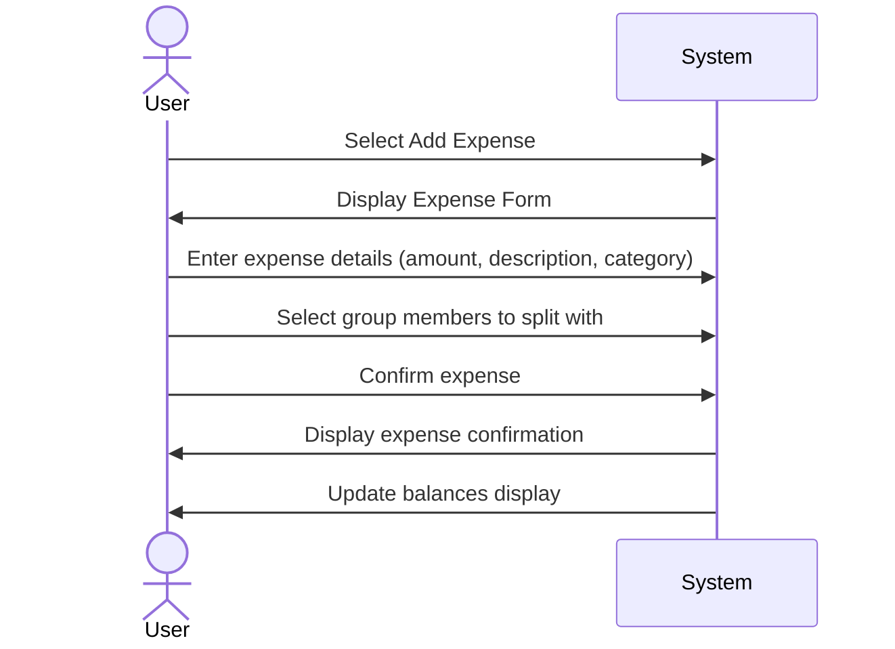
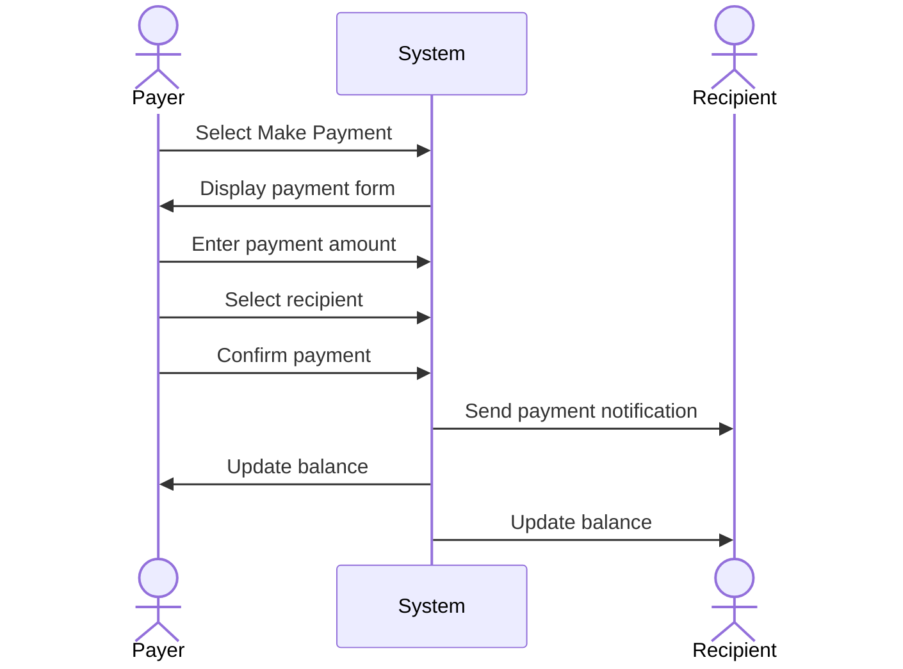
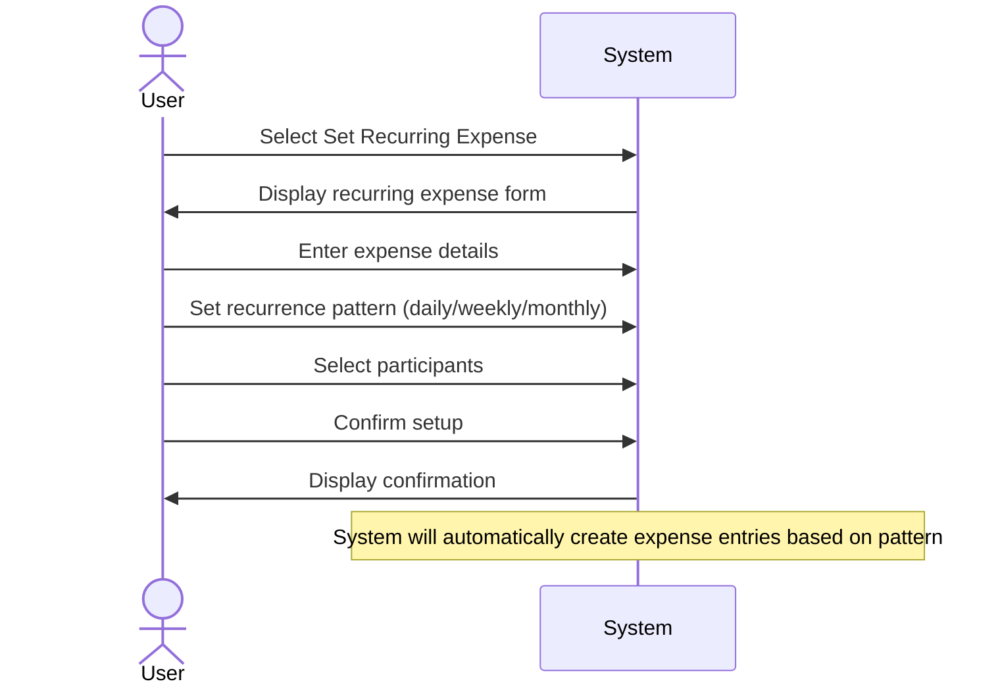
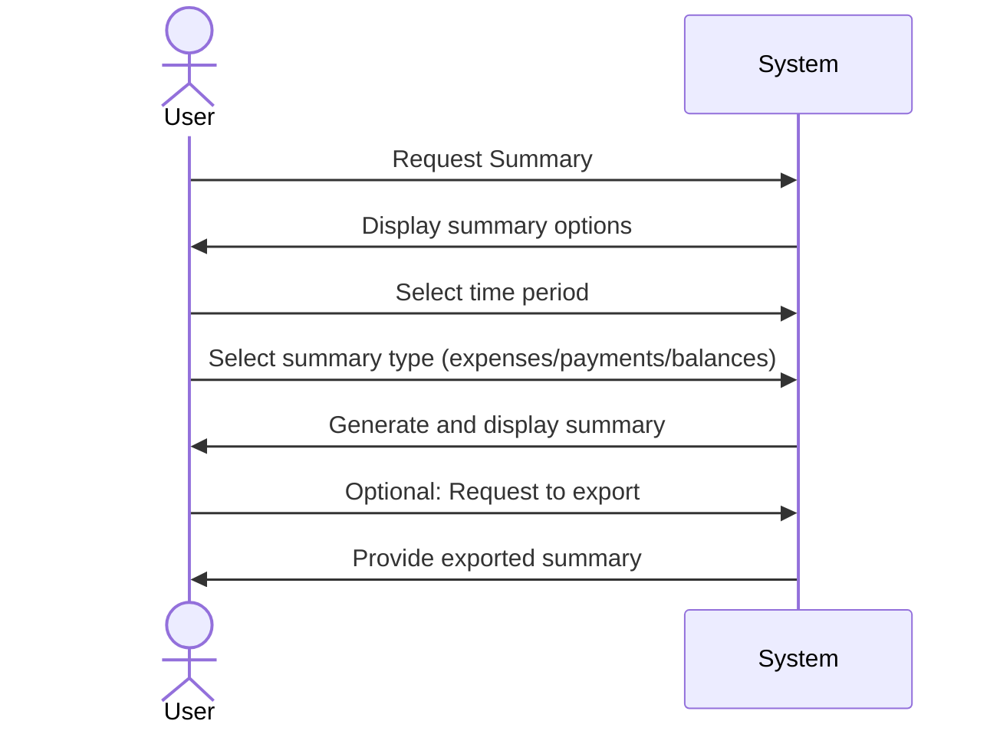
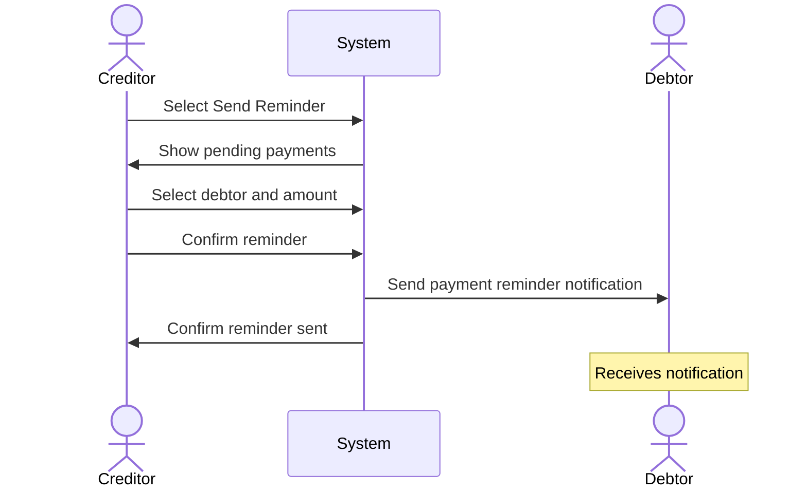
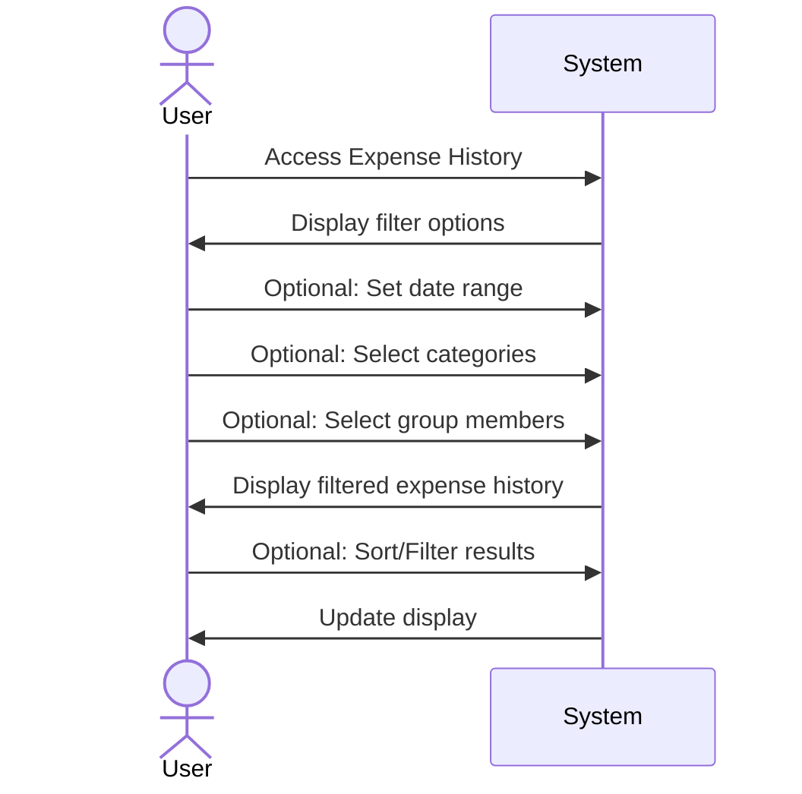
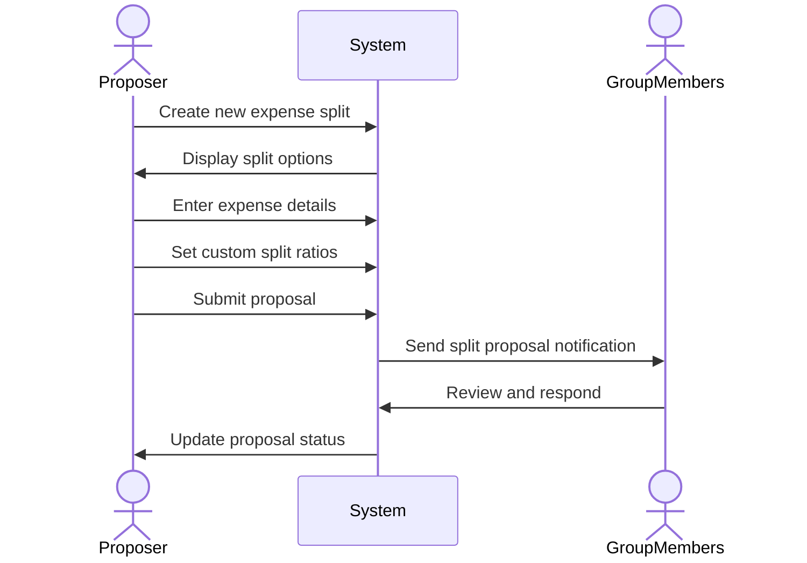
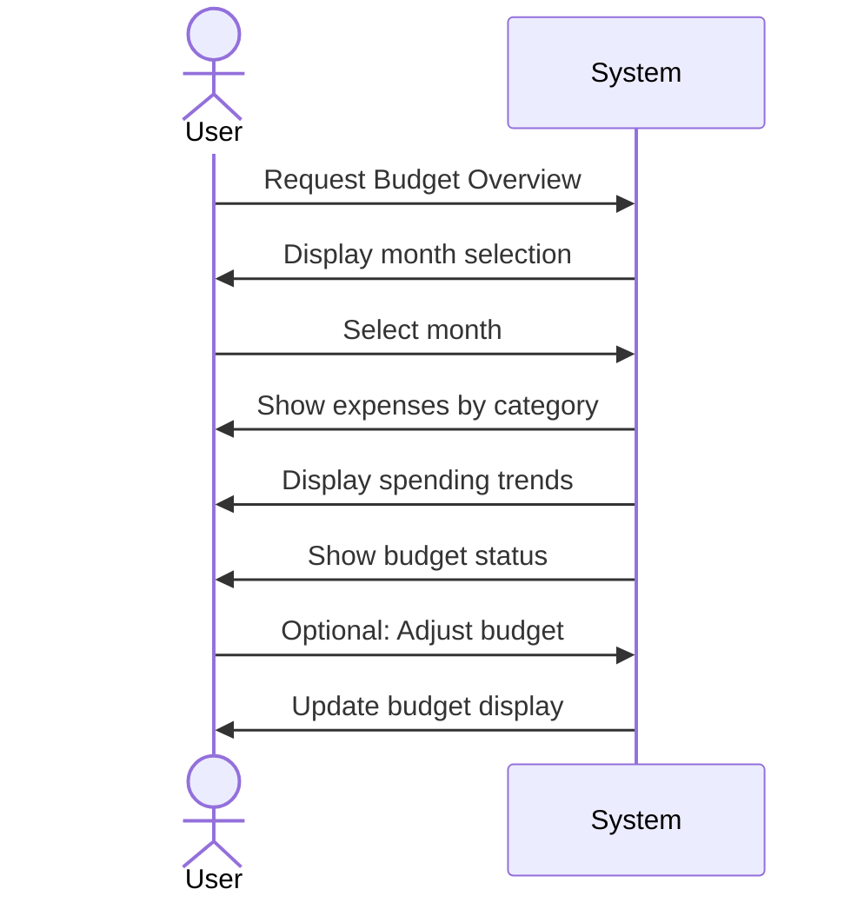

# Sequence Diagrams for RoomieBill

## Use Case 1: Adding a Shared Expense


## Use Case 2: Tracking and Logging a Payment


## Use Case 3: Automating a Recurring Expense


## Use Case 4: Generating a Summary


## Use Case 5: Sending a Payment Reminder


## Use Case 6: Viewing Expense History


## Use Case 7: Proposing a New Expense Split


## Use Case 8: Monthly Budget Overview


## Use Case 9: Group Management
```mermaid
sequenceDiagram
    actor Admin
    participant System
    actor Members
    
    Admin->>System: Access Group Settings
    System->>Admin: Display group options
    Admin->>System: Modify group settings
    Admin->>System: Add/Remove members
    System->>Members: Send group update notification
    System->>Admin: Confirm changes
    System->>Members: Update group view
